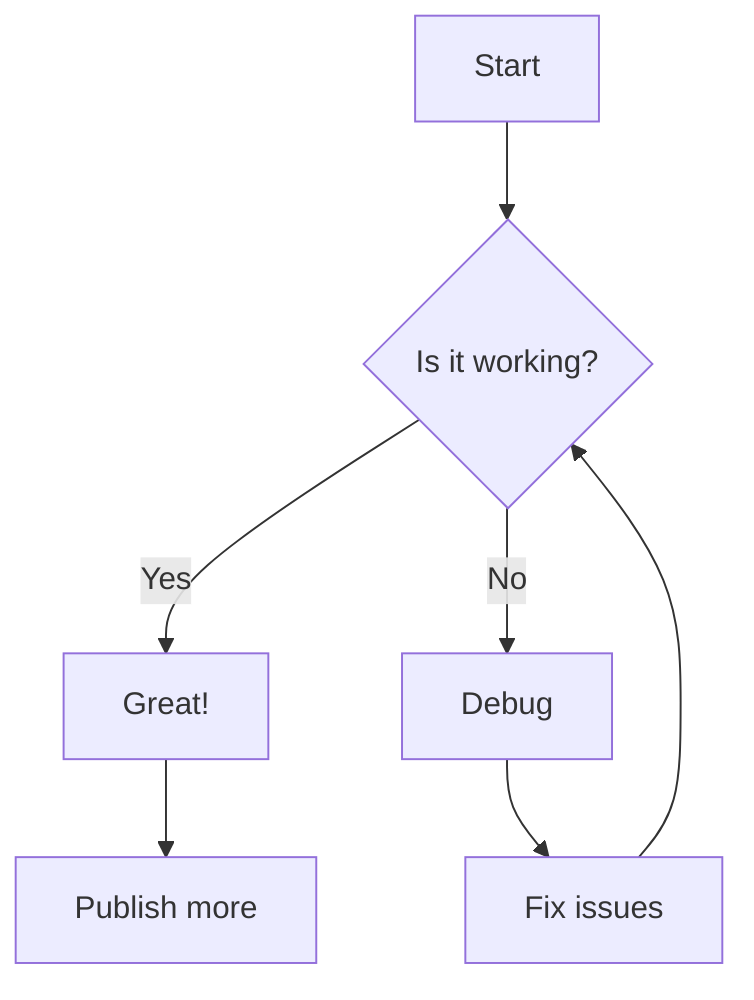

# Testing Credcast

This is a test post to verify that credcast is working correctly. Let's try all the features:

## Mermaid Diagram



## Math Equations

When $a \ne 0$, there are two solutions to $ax^2 + bx + c = 0$ and they are:

$$x = {-b \pm \sqrt{b^2-4ac} \over 2a}$$

## Code Example

```python
def test_credcast():
    """Test if credcast is working properly"""
    print("Hello from cred.at!")
    return True

# Run the test
result = test_credcast()
print(f"Test {'passed' if result else 'failed'}")
```

## cred@ Attribution

```cred
cred@github:repo:cred-at-collective/credcast
```

## Image Test


That's it! If all these elements render correctly, credcast is working as expected.
